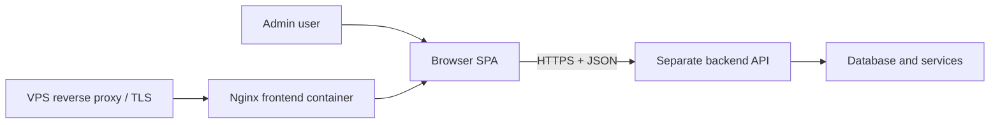

# Architecture Overview

## System Context



The frontend is an independently deployable static application. It has no server runtime and does not own business data. The backend remains authoritative for validation, authorization, persistence, and audit events.

## Repository Layers

```text
route/page composition
        ↓
feature UI + query hooks
        ↓
feature API adapters
        ↓
@starter/api-client
        ↓
generated OpenAPI bindings / fetch
```

Dependencies move downward only. Shared packages must not import the executable admin application.

## State Ownership

- Backend-owned data: TanStack Query.
- URL-visible filters, pagination, and selected tabs: TanStack Router search parameters.
- Form state: local form boundary; introduce a form library only when project needs justify it.
- Short-lived interaction state: local React state.
- Cross-session preference: backend preference first; browser storage only for non-sensitive convenience values.

## Trust Boundaries

Browser input, environment values, API responses, URL parameters, and storage are untrusted at runtime. Validate them at their entry points. Frontend permission checks improve UX but never replace backend authorization.

## Change Guidance

Add features vertically rather than adding global technical-layer folders. Add a package only when a stable reusable boundary has real consumers. Record durable architecture changes as ADRs.
